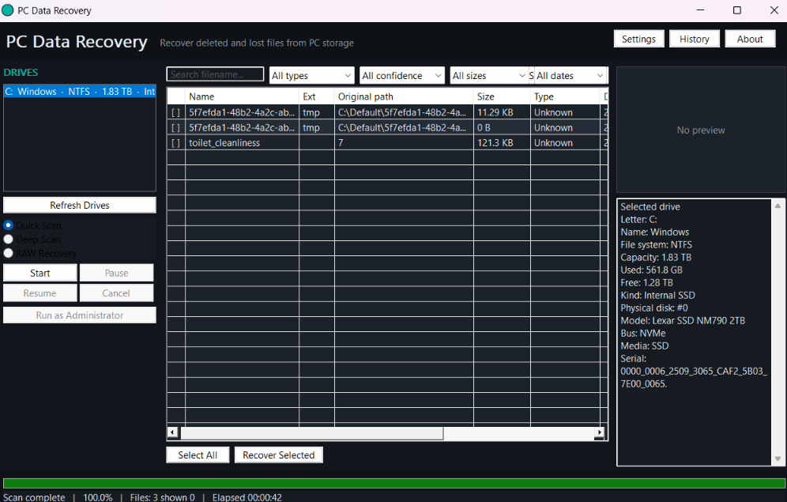
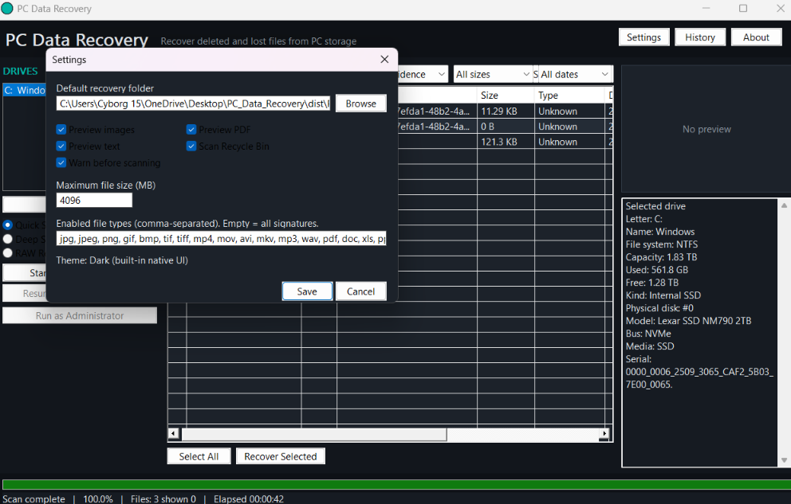

# PC Data Recovery

Native, portable Windows application for recovering deleted or lost files from PC storage devices.

- Language: C++17
- UI: Win32 (dark theme)
- Build: CMake + MSVC
- Output: `PCDataRecovery.exe` (no Python, PHP, XAMPP, ADB, or web stack)

## Screenshots

<p align="center">
  
  
</p>

<p align="center">
  <em>Left: main window with drive list, scan results, and disk info &nbsp;|&nbsp; Right: Settings</em>
</p>

## What it recovers

Deleted or lost files from:

- Internal HDD / SSD
- External HDD
- USB flash drives
- USB external SSDs
- Memory cards mounted by Windows

Supported filesystems for metadata recovery: **NTFS**, **FAT32**, **exFAT**.  
**RAW Recovery** carves known file signatures when filesystem metadata is missing or damaged.

This is not a phone / Android / ADB recovery tool.

## Safety

- Source volumes are opened **read-only**
- The scanner never writes to the source drive
- Recovery to the source volume is **blocked**
- The UI warns that continued use of a damaged or deleted-file drive can overwrite recoverable data
- Results are real scan hits only — files that cannot be reconstructed are labeled Partial, Corrupted, or Unsupported

## Features

| Area | Capability |
|---|---|
| Drive detection | Letter, label, filesystem, capacity, used/free, physical disk info |
| Scan modes | Quick, Deep, RAW |
| Recovery | Multi-select, destination picker, progress, report |
| Preview | Images (WIC), PDF header/text, TXT/CSV |
| Filters | Name, type, size, date, confidence, sort |
| Controls | Start / Pause / Resume / Cancel on a background thread |
| History | Local portable database in `data/` |
| Settings | Default folder, preview, scan options, max size, file types |

## Build (developers)

Requirements: **Visual Studio 2019/2022** with the Desktop development with C++ workload, and **CMake 3.16+**.

This machine image may not include MSVC. Install Visual Studio Build Tools, then:

```bat
cmake -S . -B build -G "Visual Studio 17 2022" -A x64
cmake --build build --config Release
cmake --build build --config Release --target portable
```

Or run `build.bat`.

The portable folder is created at:

```
dist/PCDataRecovery/
├── PCDataRecovery.exe
├── config/
├── data/
├── logs/
└── README.txt
```

End users only need that folder. They do not need Visual Studio or CMake.

## Project layout

```
PCDataRecovery/
├── CMakeLists.txt
├── src/           UI, drive, filesystem, scanner, recovery, carving, preview
├── include/
├── resources/
├── data/
└── logs/
```

## Adding file types

Edit `src/carving/SignatureDb.cpp` and add a signature with header, optional footer, and max size. The recovery engine and RAW carver pick it up automatically.

## Adding filesystems

Implement `IFileSystemScanner` (see `NtfsScanner`, `Fat32Scanner`, `ExFatScanner`) and register detection in `ScanEngine`.
